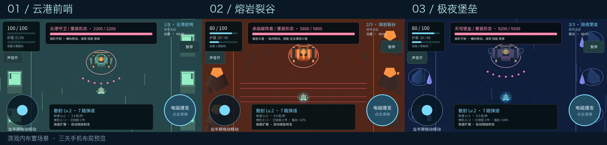

# SKYFORGE · 网页试玩

点开链接即可体验的 3D 战机射击 Demo。无需安装 Godot、下载客户端或注册账号。

**试玩：https://hxz09845.github.io/skyforge-play/**



## 玩法与操作

击毁敌机，靠近掉落物升级火力、射速和僚机。连续挑战三个主题关卡，每关三波敌机和一名首领：

| 关卡 | 变化 | 首领 |
|---|---|---|
| 云港前哨 | 青蓝港口，近战与单发敌机，练习横移躲弹 | 云港守卫：扇形为主、穿插环形弹幕 |
| 熔岩裂谷 | 熔岩与岩柱，新增有方向预警的冲锋机 | 赤焰破阵者：横向火墙，需要前后躲避 |
| 极夜堡垒 | 冰晶与极光，三发射击敌机混编冲锋机 | 天穹堡垒：扇形、环形和纵向光带交替，半血过载 |

第一关首波后选择散射、激光或僚机路线，第三波后选择改装。前两关首领击败后进入安全整备：自动回收未过期掉落，恢复耐久和护盾，技能冷却清零，并各获得一枚增加 12% 伤害的强化芯片。装备、路线与改装跨关保留，点击按钮进入下一关。第三名首领击败后才算整局通关；死亡或重开会从云港前哨重新开始。

手机横屏：左半屏空白处按住，浮动摇杆出现在手指下；向需要的方向拖动即可移动，松手停止，也可继续使用左下角固定摇杆。战机自动锁敌射击，右侧按钮释放技能。电脑：WASD 移动，默认自动向前射击；F 切换鼠标瞄准与左键射击，Q 清弹，Esc 暂停。

手机或 App 不能自动横屏时，点击 **「直接横屏玩」**，网页会把游戏画面转向；将手机顶部朝左握持即可操作，无需系统允许旋转。「尝试系统全屏」失败时也会进入网页横屏。实际切换横竖屏会暂停战斗并保留本局进度。

可选安全教学，死亡或通关后可重开。装备与路线记录仅在本次游玩进程中保留。手机在菜单或暂停时可使用右下角的分享和全屏按钮，战斗时隐藏，避免遮挡技能。加载失败时可重新加载；20 秒没有下载进展会提示继续等待或重试。

## 支持范围与限制

已验证桌面 Chromium 网页启动、中文显示、手机尺寸布局和触控输入模拟。原生引擎三关流程检查为桌面 37 项、触控模式 39 项；另有基础战斗、引导、装备路线、改装反馈与手机输入回归。六种武器改装用正常属性完成三关，固定种子自动战斗约 170–200 秒，不代表真人通关时长或完整平衡结论。

横屏与加载外壳的 41 项检查通过。手机或 App 不能自动横屏时可通过“直接横屏玩”旋转网页。尚未完成 Android/iPhone 真机、Safari 与抖音内置浏览器验证。

当前是三关试玩 Demo。暂无关卡选择、永久养成或跨启动存档；本次游玩的路线通关记录在关闭页面后清空。

浏览器需要 WebAssembly 和 WebGL 2。首次加载需要下载引擎与游戏资源。若抖音内不能打开外链，请复制地址到系统浏览器；本发布物是网页试玩版，未接入抖音小游戏。

## 本地预览与发布

本仓库是编译后的试玩站点。安装 Python 3 后执行：

```sh
python3 scripts/validate_site.py
node scripts/test_orientation.mjs index.html
python3 -m http.server 8080
```

用浏览器打开 http://localhost:8080。触控布局检查可追加 `?touch=1`。Godot 原始工程的构建使用 Godot 4.7.2、无多线程 Web 模板和 `godot --headless --export-release Web builds/web/index.html`；原始工程由项目维护者另行管理。

推送 codex/web-play 分支后，Pages 工作流校验运行资源，再部署到 GitHub Pages。此站点由 HTML 加载器、Godot JavaScript/WASM 引擎和 PCK 游戏资源组成，无后端、登录或支付功能。

## 反馈与维护

发现问题请通过 Issue 提供手机型号、浏览器、打开入口及复现步骤。参见 [贡献说明](CONTRIBUTING.md)、[路线图](ROADMAP.md)、[更新记录](CHANGELOG.md)、[安全说明](SECURITY.md)。

## 许可

本试玩站点提供个人体验。原创游戏内容权利由项目所有者保留，参见 [LICENSE](LICENSE)。Godot 及其依赖遵循各自开源许可，字体源自 Noto Sans SC，按 SIL OFL 1.1 使用；参见 [第三方说明](licenses/README.md)。
